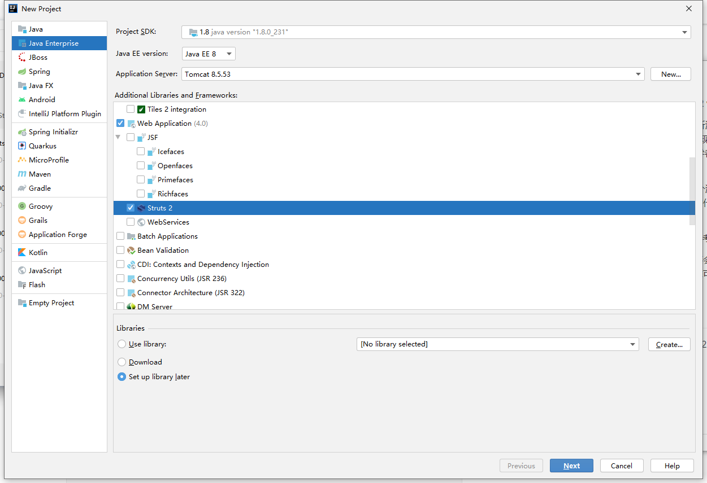
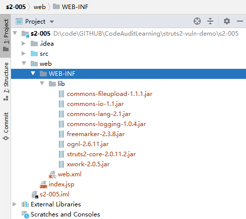
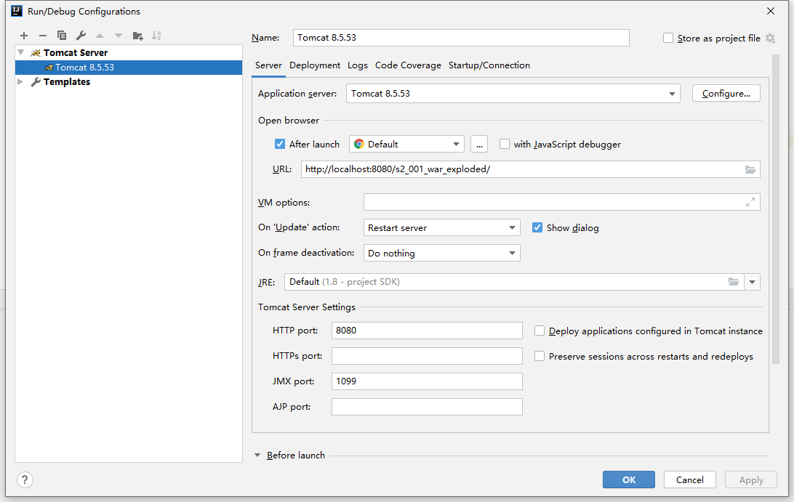
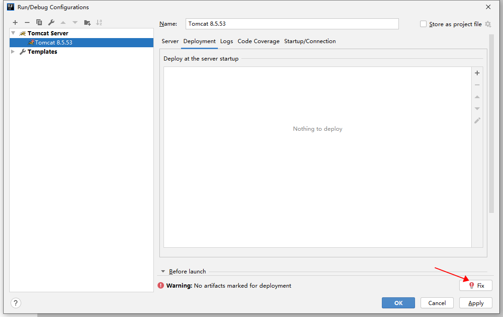

## 前言

开始学习struts2代码审计时，发现各位师傅分析漏洞的文章很多，但是给漏洞demo源码的却很少。并且不少漏洞复现是在struts2官方case上进行的。而官方case代码太多，对于初学者来说无法快速聚焦漏洞点。

所以我在学习struts2代码审计的过程中，将每个漏洞写成一个最小的工程，在个人水平范围内尽量不多写一行没用的代码。帮助初学者理解和聚焦漏洞本身，也方便入门struts2。

这些demo大部分参考的vulhub，也有些是参考struts2官方的。

调试方面，如果市面上有分析文章，我一般都不会重复造轮子再写一遍，只会记录下调试入口点以及遇到的问题。一般我都会在Reference中给出调试文章的链接，以供参考。

## Demo如何运行

- 使用idea打开某个struts2 demo工程的文件夹，如s2-001。

- 按照创建idea工程里面的方法配置好tomcat

- 点击“运行”按钮，运行成功应该会自动弹出http://localhost:8080/s2-0xx_war_exploded/

  

## 创建idea工程的步骤

以下是我创建工程的方法（Maven有坑没解决所以放弃了）

选idea自带的创建struts2工程（需要idea是ULTIMATE版），Libraries选择"Set up library later":

创建好工程后，在web/WEB-INF下新建lib文件夹，然后将下载的struts2 jar包复制进去：

 File -> Project Structure -> Modules -> Dependencies，点击 "+"选择"Jars or directories"，选中对应的lib文件夹：

最后Problems处会有个"①"，点击fix选择第一个选项。

在Edit Configurations 配置tomcat（我下载的是8.5.53版本，有些demo由于payload原因还会用到tomcat 6.0.9）：

Deployment处有Fix点击Fix：

