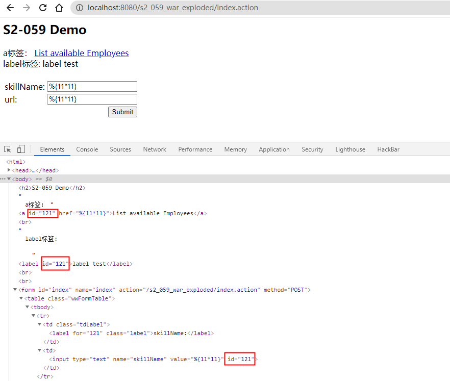
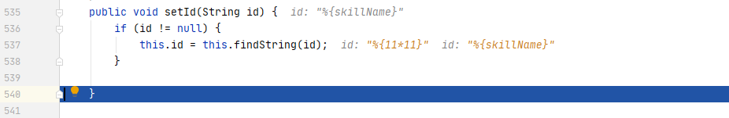

# S2-059 Demo

## Summary

| Who should read this    | All Struts 2 developers and users                            |
| :---------------------- | ------------------------------------------------------------ |
| Impact of vulnerability | Possible Remote Code Execution vulnerability                 |
| Maximum security rating | Important                                                    |
| Recommendation          | Always validate incoming parameters' values when re-assigning them to certain Struts' tags attributes.[Don't use %{...} or ${...} syntax referencing user modifiable input in tag attributes](https://struts.apache.org/security/#use-struts-tags-instead-of-raw-el-expressions) other than *value* unless you have a valid use-case.Consider activating [Proactive OGNL Expression Injection Protection](https://struts.apache.org/security/#proactively-protect-from-ognl-expression-injections-attacks-if-easily-applicable) if applicableAlternatively upgrade to [Struts 2.5.22](https://cwiki.apache.org/confluence/display/WW/Version+Notes+2.5.22) or greater |
| Affected Software       | Struts 2.0.0 - Struts 2.5.20                                 |
| Reporters               | Matthias Kaiser, Apple Information Security                  |
| CVE Identifier          | CVE-2019-0230                                                |

## Problem

Struts2 会对某些标签属性（比如`id`，其他属性有待寻找）的属性值进行二次表达式解析，因此当这些标签属性中使用了 %{x} 且 x 的值用户可控时，用户再传入一个 %{payload} 即可造成OGNL表达式执行。（引用自：[Struts2 S2-059 漏洞分析](https://mp.weixin.qq.com/s/VyLiLrUV0yakh_lzTBYGyQ)）

受影响的标签有很多，这里列举三个（改编自官方demo）：

```jsp
  a标签： <s:url var="url" action="index"/><s:a id="%{skillName}" href="%{url}">List available Employees</s:a><br/>
  label标签:  <s:label id="%{skillName}" value="label test"/><br/><br/>

  <s:form action="index" method="POST">
    <s:textfield name="skillName" label="skillName" id="%{skillName}"/>
    <s:textfield name="url" label="url" id="%{url}"/>
    <s:submit value="Submit"/>
  </s:form>
```

## Environment

| Struts2 Version | Struts-2.3.24          |
| :-------------- | :--------------------- |
| Web Server      | Tomcat 8.5.53          |
| IDE             | IDEA 2020.1.1 ULTIMATE |

## POC

同时提交skillName和url两个参数，发现只有skillName受影响，也就是id属性存在漏洞，href属性不受影响（原因见Debug），并且`<s:a>`、`<s:label>`、`<s:textfield>`标签均受影响。



可以说如果用了`id="%{xxx}"`这个写法的基本上都在劫难逃了。。

## Debug

参考链接中两位师傅的调试文章都不错，我就不再重复写了。在这里记录下漏洞的细节和一些思考。

1. 开始解析jsp标签的`doStartTag()`方法：`s2-059/web/WEB-INF/lib/struts2-core-2.3.24.jar!/org/apache/struts2/views/jsp/ComponentTagSupport.class:29`，在这里下断点。

2. 第一次ognl解析

   `s2-059/web/WEB-INF/lib/struts2-core-2.3.24.jar!/org/apache/struts2/views/jsp/ui/AbstractUITag.class:107`

   ```java
   protected void populateParams() {
           super.populateParams();
           UIBean uiBean = (UIBean)this.component;
           ...
           uiBean.setLabel(this.label);
           uiBean.setName(this.name);
           uiBean.setValue(this.value);
           uiBean.setKey(this.key);
           uiBean.setId(this.id); 
       }
   ```

   findString()方法执行了一次ognl表达式，将%{skillName}替换为了skillName的值%{11*11}。

   

3. 第二次ognl解析

   `s2-059/web/WEB-INF/lib/struts2-core-2.3.24.jar!/org/apache/struts2/components/UIBean.class:356`

   ```java
   protected void populateComponentHtmlId(Form form) {
       String tryId;
       if (this.id != null) {
           tryId = this.findStringIfAltSyntax(this.id);
       } else {
           ...
       }
   }
   ```

   findStringIfAltSyntax()调用了findString()，最终执行了第二次ognl表达式。

4. 受影响的标签

   继承AbstractUITag类的标签都会受到影响。当这些标签存在id属性时，会调用父类AbstractUITag.populateParams()方法，触发setId()解析一次ognl表达式。

5. 受影响的属性

   虽然`org.apache.struts2.components.UIBean#evaluateParams`方法中有很多属性使用findString()来获取值。但是除了id可以解析两次ognl外（算上前面的setId解析了一次），这些属性都仅解析了一次。例如同时name和id属性都存在有漏洞的写法：`<s:textfield name="%{skillName}" label="skillName" id="%{skillName}"/>`，传入`skillName=%{11*11}`，最后id解析出来是121，而name则是`%{11*11}`。所以应该只有id了吧。。

## Reference

- [S2-059](https://cwiki.apache.org/confluence/display/WW/S2-059)
- [Struts2 S2-059 漏洞分析](https://mp.weixin.qq.com/s/VyLiLrUV0yakh_lzTBYGyQ)
- [CVE-2019-0230 s2-059 漏洞分析](https://www.cnblogs.com/ph4nt0mer/p/13512599.html)