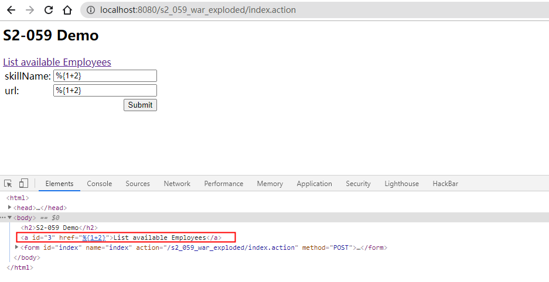

# S2-059 Demo

## Summary

| Who should read this    | All Struts 2 developers and users                            |
| :---------------------- | ------------------------------------------------------------ |
| Impact of vulnerability | Possible Remote Code Execution vulnerability                 |
| Maximum security rating | Important                                                    |
| Recommendation          | Always validate incoming parameters' values when re-assigning them to certain Struts' tags attributes.[Don't use %{...} or ${...} syntax referencing user modifiable input in tag attributes](https://struts.apache.org/security/#use-struts-tags-instead-of-raw-el-expressions) other than *value* unless you have a valid use-case.Consider activating [Proactive OGNL Expression Injection Protection](https://struts.apache.org/security/#proactively-protect-from-ognl-expression-injections-attacks-if-easily-applicable) if applicableAlternatively upgrade to [Struts 2.5.22](https://cwiki.apache.org/confluence/display/WW/Version+Notes+2.5.22) or greater |
| Affected Software       | Struts 2.0.0 - Struts 2.5.20                                 |
| Reporters               | Matthias Kaiser, Apple Information Security                  |
| CVE Identifier          | CVE-2019-0230                                                |

## Problem

Struts2 会对某些标签属性（比如`id`，其他属性有待寻找）的属性值进行二次表达式解析，因此当这些标签属性中使用了 %{x} 且 x 的值用户可控时，用户再传入一个 %{payload} 即可造成OGNL表达式执行。（引用自：[Struts2 S2-059 漏洞分析](https://mp.weixin.qq.com/s/VyLiLrUV0yakh_lzTBYGyQ)）

改编自官方demo：

```jsp
<s:url var="url" action="index"/><s:a id="%{skillName}" href="%{url}">List available Employees</s:a>
<s:form action="index" method="POST">
    <s:textfield name="skillName" label="skillName"/>
    <s:textfield name="url" label="url"/>
    <s:submit value="Submit" />
</s:form><s:a id="%{skillName}" href="%{url}">List available Employees</s:a>
```

## Environment

| Struts2 Version | Struts-2.3.24          |
| :-------------- | :--------------------- |
| Web Server      | Tomcat 8.5.53          |
| IDE             | IDEA 2020.1.1 ULTIMATE |

## POC

同时提交skillName和url两个参数，发现只有skillName受影响，也就是id属性存在漏洞，href属性不受影响。



## Debug

在doStartTag()处下断点：

`s2-059/web/WEB-INF/lib/struts2-core-2.3.24.jar!/org/apache/struts2/views/jsp/ComponentTagSupport.class:29`


`s2-059/web/WEB-INF/lib/struts2-core-2.3.24.jar!/org/apache/struts2/views/jsp/ui/AbstractUITag.class:107`

```
protected void populateParams() {
        super.populateParams();
        UIBean uiBean = (UIBean)this.component;
        ...
        uiBean.setLabel(this.label);
        uiBean.setName(this.name);
        uiBean.setValue(this.value);
        uiBean.setKey(this.key);
        uiBean.setId(this.id); 
    }
```

跟入setId，findString执行完后将%{skillName}替换为了skillName的值，可见执行了一次ognl表达式计算。


## Reference

- [S2-059](https://cwiki.apache.org/confluence/display/WW/S2-059)
- [Struts2 S2-059 漏洞分析](https://mp.weixin.qq.com/s/VyLiLrUV0yakh_lzTBYGyQ)
- [CVE-2019-0230 s2-059 漏洞分析](https://www.cnblogs.com/ph4nt0mer/p/13512599.html)